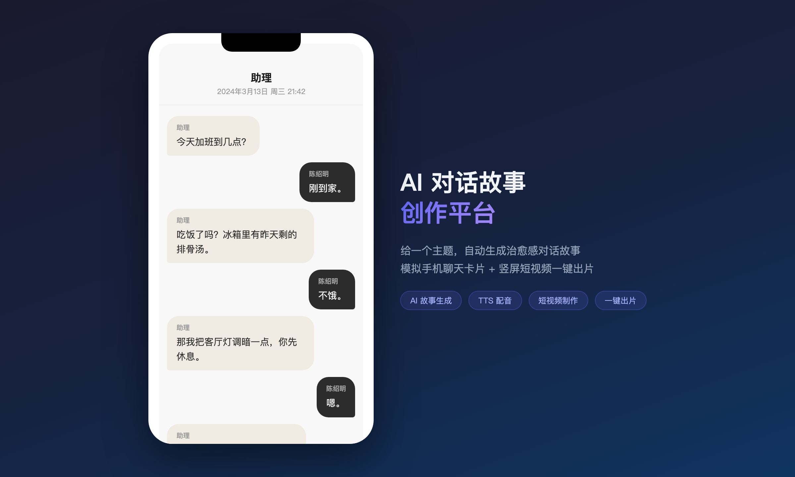
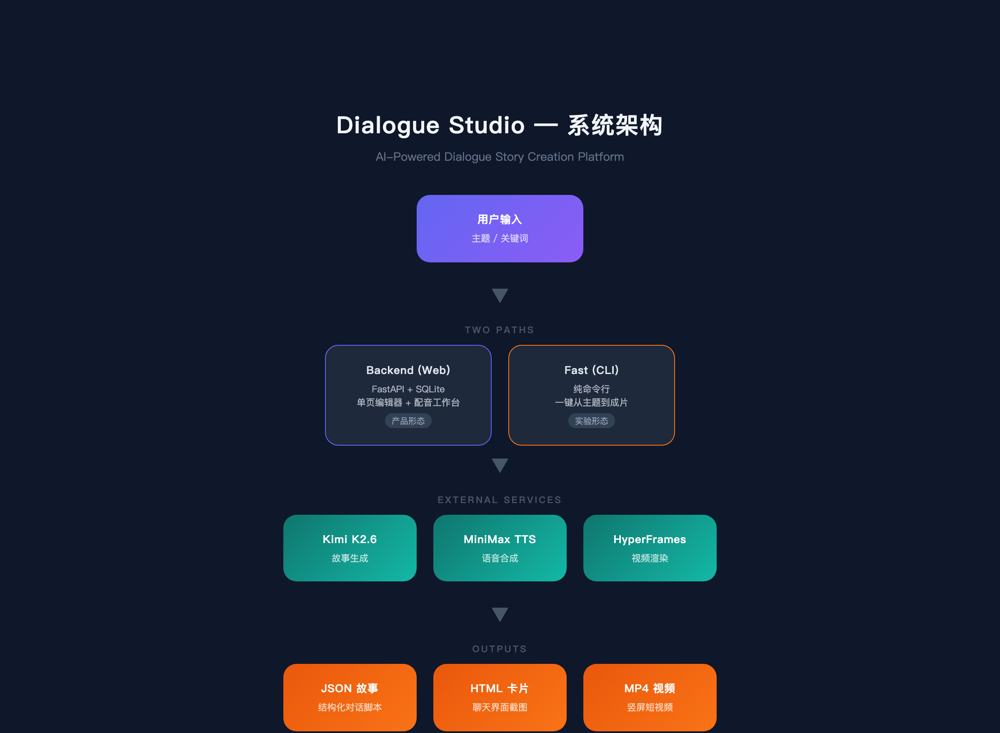
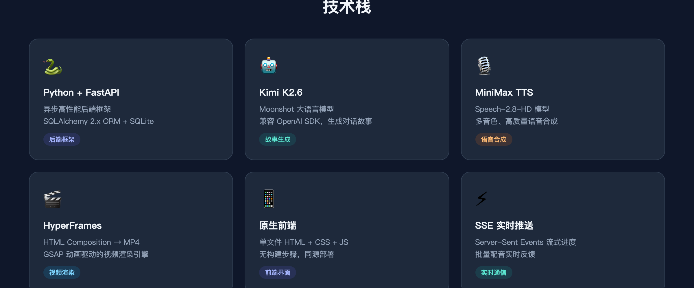
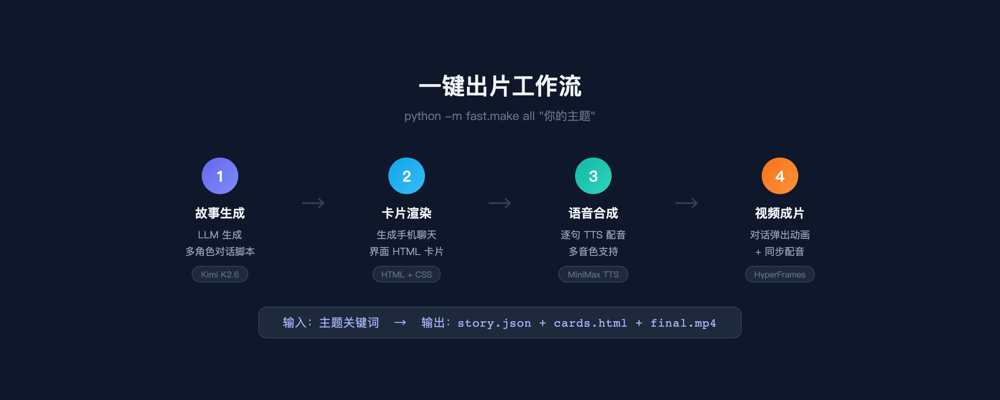

# Dialogue Studio

AI 对话体短故事创作平台 —— 给一个主题，自动生成对话故事、手机聊天卡片、竖屏短视频。



## 产物

| 产物 | 格式 | 说明 |
|---|---|---|
| 故事文本 | JSON | 多角色对话脚本，分卡片、有日期标注，可二次编辑 |
| 聊天卡片 | HTML | 模拟手机聊天界面，可截图发小红书 / 朋友圈 |
| 短视频 | MP4 | 1080×1920 竖屏，逐句弹出 + 同步配音，可直发抖音 / 视频号 |

## 两条路径

项目并存两条独立路径：

- **`backend/`** — FastAPI + SQLite + 单页前端，完整产品形态（项目库、可视化编辑、配音工作台）
- **`fast/`** — 纯 CLI + 文件系统，极简实验线（一行命令出片）

两条线完全隔离，不互相 import。

## 系统架构



## 技术栈



## 快速开始

### 环境准备

```bash
# 克隆仓库
git clone https://github.com/hughtty/AI-Dialogue-Studio.git
cd AI-Dialogue-Studio

# 创建虚拟环境
python3.12 -m venv .venv
source .venv/bin/activate

# 安装依赖
pip install -r requirements.txt
```

### 配置 API Key

```bash
cp .env.example .env
# 编辑 .env，填入你的 API Key
```

需要的 Key：
- `MOONSHOT_API_KEY` — [Moonshot 平台](https://platform.moonshot.cn/) 获取
- `MINIMAX_API_KEY` — [MiniMax 平台](https://platform.minimaxi.com/) 获取

### 方式一：Web 产品（backend）

```bash
uvicorn backend.main:app --reload
# 访问 http://localhost:8000
```

功能：项目管理 → 故事生成 → 台词编辑 → 音色配置 → 批量配音 → 视频导出

### 方式二：命令行一键出片（fast）



```bash
# 一把梭：故事 → 配音 → 视频
python -m fast.make all "下班路上的孤独感"

# 或分步执行
python -m fast.make story "你的主题"     # 生成故事
python -m fast.make audio <slug>         # TTS 配音
python -m fast.make video <slug>         # 渲染视频
```

产出在 `fast/outputs/<slug>/` 目录下。

> 视频渲染需要 Node.js 22+ 和 FFmpeg，首次运行会自动下载 Chromium。

## 项目结构

```
AI-Dialogue-Studio/
├── backend/                 # Web 产品
│   ├── main.py              # FastAPI 入口
│   ├── core/                # 配置、数据库
│   ├── models/              # SQLAlchemy 模型
│   ├── routers/             # API 路由
│   ├── services/            # 业务逻辑（LLM / TTS / 存储）
│   └── static/index.html    # 前端单页
├── fast/                    # CLI 极简分支
│   ├── make.py              # CLI 入口
│   ├── llm.py               # Kimi 故事生成
│   ├── tts.py               # MiniMax 配音
│   ├── composition.py       # HyperFrames 合成
│   └── voices.yml           # 音色映射
├── requirements.txt
└── .env.example
```

## API 概览（backend）

| 端点 | 说明 |
|---|---|
| `POST /api/story/generate` | LLM 生成对话故事 |
| `POST /api/tts/preview` | 试听任意文本 |
| `POST /api/tts/projects/{id}/batch` | SSE 批量配音 |
| `GET /api/projects` | 项目列表 |
| `GET /api/projects/{id}` | 项目详情（含台词） |

## 开发状态

- [x] Phase 0 — 工程基础（FastAPI + SQLite + CRUD）
- [x] Phase 1 — LLM 生成故事 + 卡片预览编辑器
- [x] Phase 2 — MiniMax TTS 配音 + 试听
- [ ] Phase 3 — HyperFrames 视频渲染（进行中）

## License

[MIT](LICENSE)
